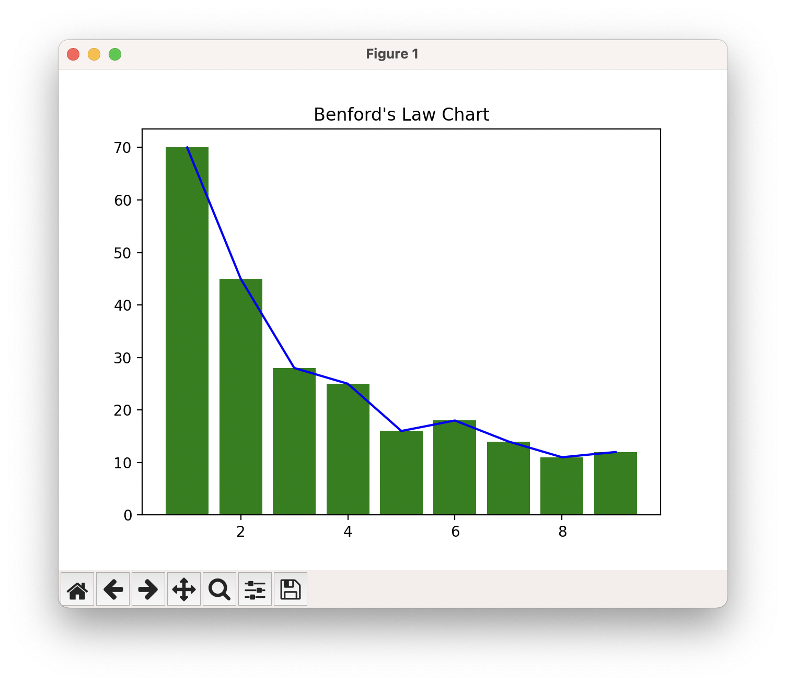

# Checking Benford's Law

From Wikipedia, _[Benford's Law](https://en.wikipedia.org/wiki/Benford%27s_law) is an observation that in many real-life sets of numerical data, the leading digit is likely to be small. In sets that obey the law, the number 1 appears as the leading significant digit about 30% of the time, while 9 appears as the leading significant digit less than 5% of the time._

Here's a graph generated from the [publicly available data](https://github.com/samayo/country-json/blob/master/src/country-by-surface-area.json) of surface area of countries:



## Usage

Optionally set up a Virtual Environment if you need by:
```shell
$ python3 -m venv .venv
$ source .venv/bin/activate
```

Install the dependencies by:
```shell
$ pip3 install -r requirements.txt
```

Run:
```shell
$ python3 benford.py
```

The script uses a publicly available data from [this repository](https://github.com/samayo/country-json). You can try out different data available in the repository, or any other data source.